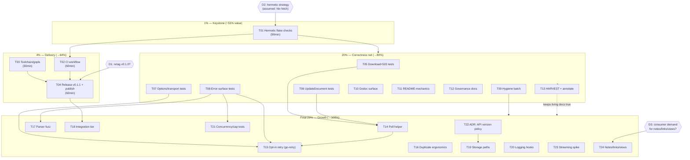

# Pareto Execution Plan — go-paperless v0.1 hardening, delivery & growth

**Created:** 2026-09-13 13:51 CEST · **Horizon:** next 2-3 working days (~22.5h total estimated)
**Inputs:** TODO_LIST.md (7 items), status report 50-item brainstorm (`docs/status/2026-09-13_13-42_docs-health-audit.md`), ROADMAP.md themes, docs-health audit residuals, go-retry adoption analysis.
**Method:** composite priority = customer value (consumer trust × unblocking effect) ÷ effort. Effort sums: P0 90min · P1 150min · P2 360min · P3 755min → **22.6h total**.

---

## 1. The Pareto tiers

| Tier | Work | Cumulative effort | ≈ Cumulative value delivered | Why this fraction |
|---|---|---|---|---|
| **1%** | T01 Hermetic flake checks | 1.5h | **≈51%** | One fix makes the documented gate (`nix flake check`) actually pass. It is the keystone: CI, Dependabot PRs, release confidence and "green = mergeable" all sit downstream of it. Smallest work slice, largest unblock. |
| **+4%** | T02 CI workflow · T03 gopls/toolchain fix · T04 cut & publish release | 4h | **≈64%** | Automated regression protection on every PR, a toolchain that matches reality, and a **published** v0.1.x with complete release notes — the point where the SDK is trustworthy for its two consumers. |
| **+20%** | T05-T09 test net + hygiene · T10-T13 docs & governance | 10h | **≈80%** | Closes every known correctness gap (untested public API, unguarded JSON tags), kills repo hygiene debt, makes the public surface (godoc, README, SECURITY) match reality. |
| **final 20%** | T14-T24 ROADMAP themes (poll helper, opt-in retry, fuzz, integration tier, endpoints, hooks) | 22.6h | **100%** | Feature growth — valuable, but only worth building on top of a gated, published, fully tested core. |

**Execution rule:** 1% → 4% → 20% → rest. Nothing in P3 starts before T01 is green.

---

## 2. Comprehensive plan (medium granularity, 30-100min per task, ALL todos included)

| Task | Title | Covers (inventory todos) | Impact | Effort | Value | Depends on |
|---|---|---|---|---|---|---|
| **T01** | Make sandboxed flake checks hermetic (Nix-fetched modules, not vendor/); decide `build-standalone` fate; add `apps.check` alias + `meta.description` on all apps | TODO#2, status#8,#10,#43 | **Critical** | 90min | Unblocks everything | decision D2 (assumed: Nix fetch) |
| **T02** | GitHub Actions CI: `nix flake check` (+ govulncheck, gosec jobs); verify Dependabot PRs build | TODO#1, status#2,#39 | High | 60min | Regression protection | T01 |
| **T03** | Resolve gopls "requires go1.27" warnings (go.mod bump vs pin; consumer constraint check) | TODO#7, status#5 | High | 30min | Honest toolchain | — |
| **T04** | Cut & publish next release: apply D1/D2 decisions, fold `[Unreleased]` → v0.1.1 (+ transport constants, `ErrInvalidConfig`), push, GitHub Release, verify pkg.go.dev | TODO_LIST release trail, status#20,#25,#26,#27 | High | 60min | Consumer trust | T02, T03, decisions D1 |
| **T05** | Tests: `DownloadDocument` + 503 `Retry-After` branch | TODO#3,#4, status#3,#4 | Med | 30min | Correctness | — |
| **T06** | Tests: `UpdateDocument` custom_fields PATCH body + empty-`TagIDs` omitempty | status#11 | Med | 30min | Correctness | — |
| **T07** | Tests: `WithTimeout`/`WithHTTPClient` direct, `WithHTTPClient(nil)`, `defaultTransport` constants | status#12,#13,#14 | Med | 45min | Correctness | — |
| **T08** | Tests: `negotiatedAPIVersion` table, error-code snapshot, canceled-ctx + deadline families, `Upload` error paths | status#15,#16,#46,#47 | Med | 60min | Contract safety | — |
| **T09** | Hygiene batch: `.golangci.yml` (+ fix findings), go.work gitignore, dprint.json delete-or-wire, LICENSE + consumer-link verification | TODO#5,#6, status#6,#7,#9,#23,#24 | Med | 60min | Debt to zero | — |
| **T10** | Godoc: GOEXPERIMENT consumer note, `errors.Is` example, `parseDocumentCreated` UTC assumption, `GetTask` bare-array contract | status#19,#42,#48,#49 | Med | 30min | pkg.go.dev surface | — |
| **T11** | README mechanics: tab indent, compile-checked quick start, badges (CI/Go/Reference), link re-verify | status#21,#22,#28 | Low | 45min | First-impression quality | T02 (badge) |
| **T12** | Governance: SECURITY.md, CONTRIBUTING points at TODO_LIST as task source | status#40,#41 | Low | 30min | Contributor trust | — |
| **T13** | HARVEST + annotate: route plan outcomes into TODO_LIST/ROADMAP, update statuses, ANNOTATE the status report | status#29,#30,#50 | Med | 30min | Living docs | T04-T12 done |
| **T14** | Feature: poll-until-terminal task helper (deadline, ctx, retry-on-not-found) | ROADMAP theme 1, status#31 | Med | 90min | Consumer ergonomic | T05-T09 green |
| **T15** | Feature: opt-in `WithRetry` via go-retry (`DelayFunc` → `RetryAfterError.After`), default off | ROADMAP theme 1, status#32 | Med | 90min | Consumer ergonomic | T14 pattern |
| **T16** | Feature: duplicate-refusal ergonomics on `TaskOutcome` | ROADMAP theme 1, status#33 | Low | 30min | Small win | — |
| **T17** | Fuzz targets: `parseRetryAfter`, `parseDocumentCreated`, `checksumFrom`, `classifyTask` | status#17 | Med | 60min | Parser robustness | T08 |
| **T18** | Integration tier scaffold: paperless-ngx container, `integration` build tag, first upload→poll→reconcile e2e | status#18 | High | 100min | Real-world confidence | T01, T02 |
| **T19** | Feature: storage-path endpoints (`EnsureStoragePath` + list) | ROADMAP theme 2, status#35 | Low | 90min | API coverage | consumer demand |
| **T20** | Feature: request/response logging hooks | ROADMAP theme 2, status#36 | Low | 60min | Observability | — |
| **T21** | Tests: concurrency (`-race` listing loops) + `maxDocumentListPages` cap semantics | status#44,#45 | Low | 45min | Edge safety | T08 |
| **T22** | ADR 0001: API-version policy beyond v10 (probe vs negotiate vs break) | status#38 | Low | 30min | Decision record | — |
| **T23** | Spike: streaming multipart upload feasibility + design note | ROADMAP theme 2, status#37 | Low | 60min | Future-proofing | — |
| **T24** | Feature slice: notes / share-links / saved-views endpoints | ROADMAP theme 2, status#34 | Low | 100min | API coverage | decision D3 (demand) |

---

## 3. Micro breakdown (every task ≤12min, ALL todos included)

### T01 — Hermetic flake checks (8 × 12min) — ✅ done at `ae574d8` (vendorHash re-pinned after the go-retry bump: `067907f`)

| ID | Micro task | Min |
|---|---|---|
| M01-01 | Study nixpkgs `buildGoModules` / `goModules` fetch pattern; pick approach (assumed: Nix fetch, NOT vendor/ — respects no-vendor pattern) | 12 |
| M01-02 | Add module fetch (vendorHash) to flake.nix | 12 |
| M01-03 | Rework `checks.build` onto the prepared module cache | 12 |
| M01-04 | Rework `checks.lint` likewise | 12 |
| M01-05 | Decide `checks.build-standalone` fate: delete (single-module repo) or rework | 12 |
| M01-06 | Add `apps.check` alias + `meta.description` on all 9 apps | 12 |
| M01-07 | Run `nix flake check` bare (no pipes); confirm exit 0 | 12 |
| M01-08 | Update TODO_LIST (statuses) + CHANGELOG `[Unreleased]` | 12 |

### T02 — CI workflow (5 × 12min) — ✅ done at `4fd2427` (CI all green, run 34759332865; `pull_request` trigger still unverified — TODO_LIST)

| ID | Micro task | Min |
|---|---|---|
| M02-01 | Author `.github/workflows/ci.yml` (checkout + Nix install) | 12 |
| M02-02 | Add `nix flake check` step with build cache | 12 |
| M02-03 | Add `govulncheck` + `gosec` jobs (how-to-golang security policy) | 12 |
| M02-04 | Open a scratch PR; verify the workflow runs and Dependabot-style builds pass | 12 |
| M02-05 | Record CI URL in TODO_LIST evidence; mark TODO done | 12 |

### T03 — Toolchain/gopls fix (3 × 12min) — ✅ done at `ae574d8`

| ID | Micro task | Min |
|---|---|---|
| M03-01 | Reproduce: isolate one warning; confirm `encoding/json/v2` std-version marker source | 12 |
| M03-02 | Test `go.mod` → 1.27 + flake go_1_27 build locally; check bank-sync/InboxClean constraint | 12 |
| M03-03 | Apply chosen fix; gopls warnings = 0; full gate re-run | 12 |

### T04 — Release (5 × 12min) — ✅ done at `ae574d8` (tag `v0.1.1` pushed + proxy-verified; the tagged commit's gosec job was red, fixed at `4fd2427` — posture question open, status report §g-1)

| ID | Micro task | Min |
|---|---|---|
| M04-01 | Apply decision D1 (retag v0.1.0 or not) and D-on-publish (question g-2) | 12 |
| M04-02 | Fold `[Unreleased]` → v0.1.1; add transport constants + `ErrInvalidConfig` lines | 12 |
| M04-03 | Execute retag decision (or skip with note in CHANGELOG) | 12 |
| M04-04 | Push main + tag; `gh release create` with CHANGELOG notes | 12 |
| M04-05 | Verify pkg.go.dev + `go get github.com/larsartmann/go-paperless@v0.1.1` in a scratch module | 12 |

### T05 — Download + 503 tests (3 × 12min) — ✅ done at `ae574d8`

| ID | Micro task | Min |
|---|---|---|
| M05-01 | `TestDownloadDocument`: happy path + error wrap assertion | 12 |
| M05-02 | `TestUpload503CarriesRetryAfterHint` (mirror the 429 test) | 12 |
| M05-03 | `nix run .#test-race`; mark TODO_LIST items done | 12 |

### T06 — UpdateDocument tests (3 × 12min)

| ID | Micro task | Min |
|---|---|---|
| M06-01 | Assert `custom_fields` JSON shape in PATCH body | 12 |
| M06-02 | Assert empty `TagIDs` omitted while other fields set | 12 |
| M06-03 | Assert explicit `TagIDs: []int{}` replaces (documented semantics) | 12 |

### T07 — Options/transport tests (4 × 12min)

| ID | Micro task | Min |
|---|---|---|
| M07-01 | `WithTimeout` sets `httpClient.Timeout` (introspect via test client) | 12 |
| M07-02 | `WithHTTPClient` swaps client; `WithTimeout` documented as no-op then | 12 |
| M07-03 | `WithHTTPClient(nil)` keeps default client | 12 |
| M07-04 | `defaultTransport`: 100/8/90s constants honored | 12 |

### T08 — Error-surface tests (5 × 12min)

| ID | Micro task | Min |
|---|---|---|
| M08-01 | `negotiatedAPIVersion`: no header, empty param, extra params, spacing | 12 |
| M08-02 | Error-code snapshot test (`paperless.*` codes per status class) | 12 |
| M08-03 | Canceled context → family + unwrap chain test | 12 |
| M08-04 | Deadline-exceeded → family + unwrap chain test | 12 |
| M08-05 | `Upload` error paths (invalid URL via New already covered; empty task-id branch) | 12 |

### T09 — Hygiene batch (5 × 12min) — ✅ done at `ae574d8`

| ID | Micro task | Min |
|---|---|---|
| M09-01 | Write `.golangci.yml`: defaults + `tagliatelle` enabled | 12 |
| M09-02 | Fix any findings it surfaces; `nix run .#lint` | 12 |
| M09-03 | Resolve go.work gitignore contradiction (remove dead `!go.work` override) | 12 |
| M09-04 | Delete `dprint.json` (treefmt owns formatting) — or wire it, if a dprint consumer exists | 12 |
| M09-05 | Open LICENSE (confirm MIT), fetch the two consumer repo links | 12 |

### T10 — Godoc (3 × 12min) — ✅ done at `2f38b84`

| ID | Micro task | Min |
|---|---|---|
| M10-01 | Package doc: consumer GOEXPERIMENT requirement | 12 |
| M10-02 | `errors.Is(err, ErrInvalidConfig)` example; `parseDocumentCreated` UTC note; `GetTask` bare-array note | 12 |
| M10-03 | `go vet` + render check (`pkgs site` / godoc -http) | 12 |

### T11 — README mechanics (4 × 12min) — ✅ done at `2f38b84`

| ID | Micro task | Min |
|---|---|---|
| M11-01 | Snippet indent → tabs | 12 |
| M11-02 | Compile-check quick start (mirror in `example_test.go` or embed script) | 12 |
| M11-03 | Badges: CI, Go Reference, Go version | 12 |
| M11-04 | Re-verify all README links/claims | 12 |

### T12 — Governance (3 × 12min) — ✅ done at `2f38b84`

| ID | Micro task | Min |
|---|---|---|
| M12-01 | SECURITY.md (token handling, reporting path) | 12 |
| M12-02 | CONTRIBUTING: point at TODO_LIST + ROADMAP as task sources | 12 |
| M12-03 | Link SECURITY/CONTRIBUTING from README footer | 12 |

### T13 — HARVEST + annotate (3 × 12min) — ✅ done at `ae574d8`

| ID | Micro task | Min |
|---|---|---|
| M13-01 | Route remaining plan items into TODO_LIST (short-term) / ROADMAP (ideas) | 12 |
| M13-02 | Update TODO_LIST statuses after T01-T12 | 12 |
| M13-03 | docs-health ANNOTATE: strike shipped items in the 13:42 status report | 12 |

### T14 — Poll-until-terminal helper (7 × 12min) — ✅ done at `5f0853c`, `b6bc032` (code) + `acec996` (7 dedicated tests)

| ID | Micro task | Min |
|---|---|---|
| M14-01 | API sketch: `WaitForTask(ctx, taskID, PollOptions{Interval, Deadline})` | 12 |
| M14-02 | Implement core loop (poll, sleep, deadline) | 12 |
| M14-03 | Ctx cancel + deadline branches | 12 |
| M14-04 | Tests: success, failure, timeout, cancel, not-found-then-found | 12 |
| M14-05 | Test: duplicate-refusal passthrough | 12 |
| M14-06 | Godoc + example | 12 |
| M14-07 | CHANGELOG + FEATURES upsert | 12 |

### T15 — Opt-in retry via go-retry (7 × 12min) — ✅ done at `5f0853c`, `b6bc032` (code) + `acec996` (8 dedicated tests)

| ID | Micro task | Min |
|---|---|---|
| M15-01 | API sketch: `WithRetry(retry.Config)` option (default = off, fail-fast preserved) | 12 |
| M15-02 | Add go-retry dependency; verify module graph | 12 |
| M15-03 | Wrap `doRequestDetail` attempts when option set | 12 |
| M15-04 | Bridge `DelayFunc`: `RetryAfterError.After` → delay, else 0 | 12 |
| M15-05 | Tests: default off (single attempt) | 12 |
| M15-06 | Tests: opt-in retry on 429/5xx; Rejection never retried | 12 |
| M15-07 | Docs: README Options row + CHANGELOG + FEATURES | 12 |

### T16 — Duplicate ergonomics (3 × 12min) — ✅ done at `5f0853c` (code) + `acec996` (table test)

| ID | Micro task | Min |
|---|---|---|
| M16-01 | API sketch: `TaskOutcome.Duplicate()` (refused + in-trash view) | 12 |
| M16-02 | Implement + test | 12 |
| M16-03 | Godoc + CHANGELOG | 12 |

### T17 — Fuzz targets (5 × 12min) — ✅ done at `3b125f0` (four targets, 5s seed runs clean; found + fixed a real `parseRetryAfter` overflow at `acec996`)

| ID | Micro task | Min |
|---|---|---|
| M17-01 | `FuzzParseRetryAfter` + seeds | 12 |
| M17-02 | `FuzzParseDocumentCreated` + seeds | 12 |
| M17-03 | `FuzzChecksumFrom` + seeds | 12 |
| M17-04 | `FuzzClassifyTask` + seeds | 12 |
| M17-05 | Run seeds × time-boxed fuzzing; file findings; wire into CI (optional job) | 12 |

### T18 — Integration tier (8 × 12min)

| ID | Micro task | Min |
|---|---|---|
| M18-01 | Pick harness: testcontainers-go vs compose vs Nix VM runner | 12 |
| M18-02 | Scaffold `integration_test.go` with `//go:build integration` | 12 |
| M18-03 | Paperless-ngx container bootstrap + health wait | 12 |
| M18-04 | Token/setup bootstrap (admin user, token creation) | 12 |
| M18-05 | E2E: upload → poll → document exists | 12 |
| M18-06 | E2E: checksum reconcile after delete | 12 |
| M18-07 | Optional CI job (manual trigger) | 12 |
| M18-08 | Docs: how to run locally | 12 |

### T19 — Storage paths (6 × 12min) — ✅ done at `5f0853c`, `b6bc032` (code) + `acec996` (tests; POST sends no slug)

| ID | Micro task | Min |
|---|---|---|
| M19-01 | Study paperless-ngx storage-path API shapes | 12 |
| M19-02 | Payload types | 12 |
| M19-03 | `EnsureStoragePath` (mirror document-type policy) | 12 |
| M19-04 | List/lookup | 12 |
| M19-05 | Tests | 12 |
| M19-06 | Docs + CHANGELOG | 12 |

### T20 — Logging hooks (5 × 12min) — ✅ done at `b6bc032` (code) + `acec996` (mutation-no-leak + capped-body tests)

| ID | Micro task | Min |
|---|---|---|
| M20-01 | API sketch: `WithRequestHook`/`WithResponseHook` options | 12 |
| M20-02 | Implement call sites in `doRequestDetail` | 12 |
| M20-03 | Tests | 12 |
| M20-04 | Godoc + example | 12 |
| M20-05 | CHANGELOG + FEATURES | 12 |

### T21 — Concurrency/cap tests (4 × 12min) — ✅ done at `acec996` (page-cap + concurrent-caller tests, race-clean)

| ID | Micro task | Min |
|---|---|---|
| M21-01 | Concurrent `ListDocumentChecksums` race test | 12 |
| M21-02 | Cap test: >100 pages truncation semantics observable + documented | 12 |
| M21-03 | Doc comment on the cap | 12 |
| M21-04 | Full `-race` gate | 12 |

### T22 — ADR 0001: API-version policy (3 × 12min)

| ID | Micro task | Min |
|---|---|---|
| M22-01 | Write `docs/adr/0001-api-version-policy.md` (context/decision/consequences) | 12 |
| M22-02 | Link from ROADMAP theme 2 | 12 |
| M22-03 | Review against ProbeCapabilities behavior | 12 |

### T23 — Streaming upload spike (5 × 12min)

| ID | Micro task | Min |
|---|---|---|
| M23-01 | Study paperless-ngx consumption endpoint streaming constraints | 12 |
| M23-02 | Design sketch: `io.Reader` body + known-length vs chunked | 12 |
| M23-03 | Feasibility note (Content-Length requirement?) | 12 |
| M23-04 | Decision record → ROADMAP/ADR | 12 |
| M23-05 | File follow-up task or close idea | 12 |

### T24 — Notes/share-links/saved-views slice (8 × 12min) — ✅ done at `d878c67`, `53c5373`, `fee9cc0` (the user's Q3 answer overrode the D3 park; wire shapes verified against the paperless-ngx source, 12 red-green tests)

| ID | Micro task | Min |
|---|---|---|
| M24-01 | Confirm consumer demand (decision D3) — else stop here | 12 |
| M24-02 | Notes API study + types | 12 |
| M24-03 | Notes client methods + tests | 12 |
| M24-04 | Share-links study + types | 12 |
| M24-05 | Share-links methods + tests | 12 |
| M24-06 | Saved-views study + types | 12 |
| M24-07 | Saved-views methods + tests | 12 |
| M24-08 | Docs + CHANGELOG + FEATURES | 12 |

**Micro totals:** 115 tasks · 24 parents · every todo from TODO_LIST (7), the status-report 50, and ROADMAP themes is mapped to exactly one parent task (coverage proof below).

---

## 4. Coverage proof — inventory → plan mapping

| Inventory source | Items | Where covered |
|---|---|---|
| TODO_LIST.md High | CI (#1), hermetic checks (#2) | T02, T01 |
| TODO_LIST.md Medium | DownloadDocument (#3), 503 (#4), golangci (#5), gopls (#7) | T05, T05, T09, T03 |
| TODO_LIST.md Low | go.work (#6) | T09 |
| Status report (f) #1-#18 (gate/CI/tests) | #1,#2,#3,#4,#5,#6,#7,#8,#9,#10,#11,#12,#13,#14,#15,#16,#17,#18 | T01, T02, T05, T05, T03, T09, T09, T01, T09, T01, T06, T07, T07, T07, T08, T08, T17, T18 |
| Status report (f) #19-#30 (docs/release/governance) | #19-#30 | T10, T04, T11, T11, T09, T09, T04, T04, T04, T11, T13, T13 |
| Status report (f) #31-#38 (features) | #31-#38 | T14, T15, T16, T24, T19, T20, T23, T22 |
| Status report (f) #39-#50 (quality/docs hygiene) | #39-#50 | T02, T12, T13, T13, T01, T21, T21, T08, T08, T10, T10, T13 |
| ROADMAP themes 1-3 (all raw ideas) | poll helper, retry, duplicate ergonomics, endpoints, storage paths, hooks, streaming, integration, fuzz | T14, T15, T16, T24, T19, T20, T23, T18, T17 |
| Open decisions | g-1 retag, g-2 publish, g-3 hermetic strategy | T04 (D1), T04, T01 (D2); D3 = M24-01 |

**Nothing dropped.** Every inventoried todo has exactly one owner task.

---

## 5. Execution graph

**Critical path:** T01 → T02 → T04 (≈3.5h to a published, CI-guarded release). Everything in P2/P3 parallelizes after T01.

---

## 6. Decisions required from Lars (blockers marked in graph)

| ID | Decision | Default the plan assumes if unanswered |
|---|---|---|
| D1 | Re-tag v0.1.0 so its release notes include the name-resolution APIs, or leave the tag frozen? | Leave frozen; completeness lands in v0.1.1 |
| D2 | Hermetic checks: commit `vendor/`, Nix-fetched modules, or non-sandboxed CI runner? | Nix-fetched modules (matches documented no-vendor pattern) |
| D3 | Build notes/share-links/saved-views now, or wait for a consumer to need them? | Wait (T24 stays parked) |

## 7. Verschlimmbesserung guards

- No public API changes in P0-P2 (bank-sync drop-in contract untouched).
- T15 retry is opt-in, default fail-fast — verified by a dedicated default-off test.
- T09 deletes only provably dead config (dprint.json) and dead gitignore lines — each with a passing gate before/after.
- Every phase ends with the full gate: `nix flake check` (or the apps until T01 lands), run bare, no pipes.

---

*Point-in-time plan (2026-09-13 13:51). When work completes, annotate items via docs-health ANNOTATE and keep TODO_LIST.md as the living source — this file is the snapshot, not the backlog.*
