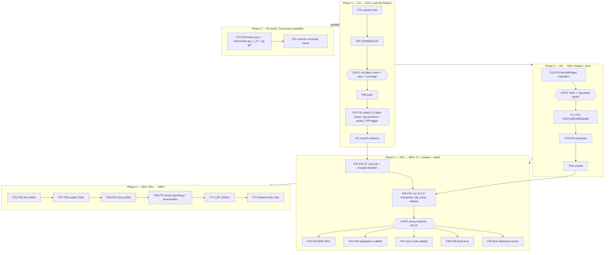

# Pareto Plan — v0.3.0 Landing & Hardening

**Date:** 2026-09-13 18:40 CEST
**Inputs:** `TODO_LIST.md` (open rows), `docs/status/2026-09-13_18-37_18-skills-full-audit-and-hardening.md` (§f, 50 items), the in-flight parallel-session feature (document notes / share links / saved views — tests committed in `d878c67`, implementation uncommitted but gate-verified green), and the go.mod toolchain flap of 18:35–18:36 (pin to 1.26.7 + revert; net zero, `go 1.27` intact).

**Context in one paragraph:** The SDK just came out of an 18-skill full audit (all gates green, coverage 90.1% pre-feature, `fetchAllPages[T]` dedup landed, govulncheck pinned, GOTOOLCHAIN hardened). A parallel session added three new API families — notes, share links, saved views — with 507 lines of tests already committed and 523 lines of implementation sitting uncommitted in the working tree, verified green by me just now (build ✓, 83 tests ✓). Two of the new `List*` functions hand-roll the pagination loop that `fetchAllPages[T]` was extracted to own — the exact drift the dedup prevented. Tag `v0.2.0` sits at HEAD; consumers (bank-sync, InboxClean) still run `go_1_26` and cannot build against this module until their flakes bump. CI has an unverified govulncheck pin, a possibly-still-red gosec job, and no race job.

---

## Pareto Breakdown

### The 1% that delivers 51%

**Land the in-flight feature and push.** The work is 95% done (impl written, tests committed, gates green). Committing it with a proper message, adding the CHANGELOG entry, and pushing does four things at once: ships three new API families to consumers, un-orphans the committed tests, exercises the pinned govulncheck in real CI, and answers the gosec-red question from the CI run itself. Nothing else on the list matters if the tree's newest feature sits uncommitted.

### The 4% that delivers 64%

1. **Dedup the new pagination** — migrate `ListShareLinks` + `ListSavedViews` onto `fetchAllPages[T]` with cap-parity tests. Policy back to exactly one home before anyone copies it a fourth time.
2. **Docs batch for the new families** — FEATURES rows, README feature list, CHANGELOG curation, examples (`WaitForTask` + retry + one new-family example). Docs that lag features become lies.
3. **Consumer flakes to `go_1_27`** (bank-sync, InboxClean) — without this, no consumer can `go get` anything ≥ v0.1.1; it is the actual delivery blocker for every improvement in this module.

### The 20% that delivers 80%

4. CI hardening: `test-race` job (+ flake `checks.test-race`), triage the CI run from the push in the 1% step (govulncheck green? gosec red? PR trigger?), erraudit gate decision.
5. `v0.3.0` release cut (notes + share links + saved views + the audit's hardening batch) — CHANGELOG, tag, GitHub release, proxy verification.
6. ADR 0001 (API-version policy beyond v10) + `docs/adr/` scaffold.
7. Integration test scaffold (`//go:build integration`) — the one test class httptest cannot fake.
8. Error-code catalog (`paperless.*`) + FEATURES de-staling (line numbers → stable test names).
9. bank-sync fork-retirement decision (it gates whether consumers keep trimming their own copies).
10. Timed fuzz sessions + coverage re-run for the enlarged surface.

### The other 20% to reach 100%

Test polish (ctx-cancel, `t.Context()` harmonize, cleanup-style harmonize), `GetTask` array-fallback comment, typed `MatchingAlgorithm`, `ProbeCapabilities` hook test, supply-chain pinning (actions SHA, dependabot github-actions, gitleaks/trivy), README polish (retry snippet, `Default*` constants, Find/Get/Ensure contract), docs plumbing (reviews INDEX.md, release checklist, ROADMAP harvest, flake version comment), `BenchmarkUpload`, inline `documentListPage`, PR template, `.golangci.yml` review, LSP-restart confirmation, and the conditional `client.go` split (watch item at ~3k lines, not a scheduled task).

---

## Coarse Plan — 26 tasks, 30–100 min each (sorted: importance / impact / effort / customer value)

| # | Task | Tier | Impact | Effort | Customer value | Depends on |
|---|------|------|--------|--------|----------------|------------|
| C01 | Land in-flight feature: commit notes/share-links/saved-views impl + CHANGELOG entry, full gate battery, push | 1%→51% | Critical | 60m | Ships 3 API families; un-orphans committed tests; first real CI run of pinned govulncheck | — |
| C02 | CI triage of the C01 push: govulncheck@v1.8.0 green? gosec still red? PR trigger works? Fix or document findings | 1%→51% | Critical | 50m | Turns CI from "assumed" to "verified"; closes two open TODO evidence gaps | C01 |
| C03 | Migrate `ListShareLinks` + `ListSavedViews` to `fetchAllPages[T]` + cap-parity tests for both | 4%→64% | High | 45m | Pagination policy back to one home; new families get the same 100-page-cap guarantee | C01 |
| C04 | Docs batch: FEATURES rows ×3 families, README feature bullets, de-stale FEATURES line citations → test names | 4%→64% | High | 60m | Docs match the code; consumers discover the new APIs | C01 |
| C05 | Examples batch: `ExampleClient_WaitForTask`, `WithRetry` policy example, one new-family example (notes) | 4%→64% | Med | 45m | README↔code drift guard; onboarding for the new surface | C01 |
| C06 | Consumer flakes → `go_1_27`: bank-sync + InboxClean (cross-repo, `go get` this module, build+test) | 4%→64% | Critical (delivery blocker) | 60m | Consumers can finally consume v0.1.1+ | — (parallel-safe) |
| C07 | CI `test-race` job + `flake.nix` `checks.test-race` | 20%→80% | Med | 40m | Race safety enforced, not just locally verified | C02 |
| C08 | erraudit CI gate decision + wiring (or documented drop) | 20%→80% | Med | 35m | Error-modernization regression guard | C02, Q1 |
| C09 | Cut `v0.3.0`: curate CHANGELOG, tag, GitHub release, proxy + pkg.go.dev verification | 20%→80% | High | 60m | Delivers everything above to consumers via the module proxy | C01–C05 |
| C10 | ADR 0001 — API-version policy beyond v10 + `docs/adr/` scaffold | 20%→80% | Med | 50m | Decision record the ROADMAP's confidence theme references | — |
| C11 | Integration test scaffold (`//go:build integration`, env-driven, skip-if-unset) | 20%→80% | High | 100m | Only test class that exercises real server behavior | C01 |
| C12 | Error-code catalog `paperless.*` (FEATURES table or docs page) | 20%→80% | Med | 45m | Consumers can switch on codes without reading SDK source | C01 |
| C13 | Timed fuzz sessions ×4 (`-fuzztime=30s`), commit any crashers, coverage re-run on enlarged surface | 20%→80% | Med | 40m | Deepens the only cheap continuous verification we have | C01 |
| C14 | bank-sync fork-retirement decision + migration sketch (decision artifact) | 20%→80% | High | 60m | Ends the trimmed-fork split brain | Q3 |
| C15 | Test polish batch: plain-request ctx-cancel test, harmonize `t.Context()` (6 sites), harmonize `defer server.Close()` vs `t.Cleanup` | →100% | Low-Med | 60m | Consistency; future diffs stay clean | — |
| C16 | `GetTask` bare-array fallback: document or fix the error-wrap choice; note the double allocation | →100% | Low | 30m | Honesty in an obscure path | — |
| C17 | Typed `MatchingAlgorithm` enum (unexported) replacing bare int constants | →100% | Low | 30m | Type safety in the tag self-heal path | — |
| C18 | `ProbeCapabilities` hook-coverage assertion test | →100% | Low | 30m | Closes TODO f-34 evidence row | — |
| C19 | Supply chain: pin GitHub Actions by SHA; dependabot `github-actions` ecosystem; gitleaks/trivy decision | →100% | Med | 45m | Hardens the pipeline that C02 just verified | C02 |
| C20 | SECURITY.md: Set-Cookie redaction note (response hooks) | →100% | Low | 30m | Prevents a real secret-leak footgun | — |
| C21 | README polish: `WithRetry` snippet, `Default*` constants, Find/Get/Ensure verb contract | →100% | Low-Med | 35m | Onboarding quality | C04 |
| C22 | Docs plumbing: `docs/reviews/INDEX.md`, release checklist in CONTRIBUTING, ROADMAP harvest, flake.nix version comment | →100% | Low-Med | 60m | Series navigation; repeatable releases | C09 |
| C23 | Benchmarks: `BenchmarkUpload` (multipart cost); inline `documentListPage` into probe | →100% | Low | 40m | Performance visibility; dead type cleanup | — |
| C24 | PR template + `.golangci.yml` review against how-to-golang defaults | →100% | Low | 40m | Contribution quality; lint alignment | — |
| C25 | Post-restart LSP confirmation (`.crushrc` GOTOOLCHAIN pin) + close the TODO row or fix the pin syntax | →100% | Low | 30m | Every future session flies with full tooling | — (needs Crush restart) |
| C26 | v0.1.1 release-body note (red gosec) — append or leave, per your answer | →100% | Low | 30m | Closes the oldest BLOCKED row | Q2, C02 |

**Watch item (not a task):** split `client.go` into transport/tasks/named/documents files when it crosses ~3k lines or the next resource family lands — the seams are already named.

---

## Fine Plan — 66 tasks, ≤12 min each (sorted: importance / impact / effort / customer value)

### Phase 1 — Land (1% → 51%)

| # | Task | Time | Verifies |
|---|------|------|----------|
| F01 | `git add client.go` — commit in-flight notes/share-links/saved-views impl with detailed message | 10m | git log |
| F02 | Add 3 new API families to CHANGELOG `[Unreleased]` Added | 10m | grep |
| F03 | Run `nix flake check` (build/test/lint/fmt) on the landed tree | 8m | exit 0 |
| F04 | Run `nix run .#test-race` | 8m | exit 0 |
| F05 | `nix run .#coverage` fresh baseline on enlarged surface; record number | 8m | output |
| F06 | `git push origin main` | 5m | push output |
| F07 | Watch the CI run: flake-check job green? | 10m | GH Actions |
| F08 | Watch the CI run: govulncheck@v1.8.0 green? | 10m | GH Actions |
| F09 | Watch the CI run: gosec green or red? Capture evidence either way | 10m | GH Actions |
| F10 | Open a throwaway PR (or note) to verify the `pull_request` trigger fires | 12m | GH Actions |
| F11 | Record CI findings into TODO_LIST evidence cells | 8m | file |

### Phase 2 — Dedup + docs (4% → 64%)

| # | Task | Time | Verifies |
|---|------|------|----------|
| F12 | Rewrite `ListShareLinks` onto `fetchAllPages[shareLinkPayload]` | 12m | tests green |
| F13 | Rewrite `ListSavedViews` onto `fetchAllPages[savedViewPayload]` | 12m | tests green |
| F14 | Add `TestListShareLinksCapStopsAtMaxPages` | 12m | test passes |
| F15 | Add `TestListSavedViewsCapStopsAtMaxPages` | 12m | test passes |
| F16 | Confirm error codes/messages survive the migration (grep `decode_share_links`/`decode_saved_views`) | 8m | grep |
| F17 | FEATURES.md: notes family row(s) with test citations by name | 12m | row present |
| F18 | FEATURES.md: share-links family row(s) | 12m | row present |
| F19 | FEATURES.md: saved-views family row(s) | 12m | row present |
| F20 | FEATURES.md: replace stale `client_test.go:NNN` citations with stable test names (sweep) | 12m | no NNN left |
| F21 | README: add the 3 families to the Features bullets | 8m | render |
| F22 | `ExampleClient_WaitForTask` example test | 12m | `go test` |
| F23 | `WithRetry(RetryPolicy{...})` example test | 12m | `go test` |
| F24 | `ExampleClient_AddDocumentNote` example test | 12m | `go test` |
| F25 | TODO_LIST harvest: statuses updated for landed work | 8m | file |
| F26 | Commit phase 2 (one logical commit, detailed message) | 6m | git log |

### Phase 3 — Consumers (parallel-safe, 4% block)

| # | Task | Time | Verifies |
|---|------|------|----------|
| F27 | bank-sync: flake `go_1_26` → `go_1_27`, `nix flake check` | 12m | exit 0 |
| F28 | bank-sync: `go get github.com/larsartmann/go-paperless@v0.2.0` + tidy + build + test | 12m | exit 0 |
| F29 | InboxClean: same flake bump + check | 12m | exit 0 |
| F30 | InboxClean: `go get` + tidy + build + test | 12m | exit 0 |
| F31 | Commit both consumer repos (their conventions) | 10m | git log |

### Phase 4 — CI + release (20% → 80%)

| # | Task | Time | Verifies |
|---|------|------|----------|
| F32 | ci.yml: add `test-race` job (nix run .#test-race or setup-go -race) | 12m | CI green |
| F33 | flake.nix: add `checks.test-race` | 10m | `nix flake check` |
| F34 | erraudit installability check (public module path? per Q1 answer) | 10m | evidence |
| F35 | Wire or drop the erraudit CI gate accordingly | 12m | CI green |
| F36 | Curate CHANGELOG `[Unreleased]` → `[0.3.0] - <date>` | 10m | grep |
| F37 | Pre-tag verification: clean tree, `nix flake check`, no local replaces (`grep '^replace' go.mod`) | 8m | exit 0 |
| F38 | Tag `v0.3.0` (annotated) + push tag | 6m | `git tag` |
| F39 | Verify proxy: `go list -m github.com/larsartmann/go-paperless@v0.3.0` (clean GOPROXY env) | 10m | resolves |
| F40 | GitHub Release with curated notes (`--prerelease` per 0.x policy) | 12m | release page |
| F41 | Verify pkg.go.dev picks up v0.3.0 | 8m | page |
| F42 | ADR scaffold `docs/adr/0001-api-version-policy.md` (context/decision/consequences) | 12m | file |
| F43 | ADR 0001 content: probe-vs-negotiate-vs-break, `ProbeCapabilities` evidence | 12m | file |
| F44 | Integration scaffold: build-tagged file + env plumbing + skip-if-unset | 12m | compiles |
| F45 | Integration: upload → poll → reconcile happy path | 12m | optional run |
| F46 | Integration: document how to run in CONTRIBUTING | 8m | file |
| F47 | Error-code catalog table (all `paperless.*` codes from client.go) | 12m | grep parity |
| F48 | Timed fuzz: `FuzzParseRetryAfter` + `FuzzParseDocumentCreated` 30s each | 10m | no crash |
| F49 | Timed fuzz: `FuzzChecksumFrom` + `FuzzClassifyTask` 30s each | 10m | no crash |
| F50 | bank-sync fork-retirement decision memo (consumers, risks, migration steps) | 12m | file |

### Phase 5 — The other 20% → 100%

| # | Task | Time | Verifies |
|---|------|------|----------|
| F51 | Plain-request ctx-cancel test (non-WaitForTask path) | 12m | test passes |
| F52 | Harmonize `context.Background()` → `t.Context()` (6 older test sites) | 10m | tests green |
| F53 | Harmonize `defer server.Close()` → `t.Cleanup(server.Close)` (optional; decide + apply or document choice) | 12m | tests green |
| F54 | `GetTask` array fallback: comment the error-wrap choice (or merge errors) | 8m | comment |
| F55 | Typed `MatchingAlgorithm` enum (unexported) + 4 call-site updates | 12m | build |
| F56 | `TestProbeCapabilitiesFiresHooks` | 12m | test passes |
| F57 | Pin actions/checkout + setup-go + nix-installer by SHA | 10m | CI green |
| F58 | dependabot: add `github-actions` ecosystem block | 6m | config |
| F59 | gitleaks/trivy CI decision + (maybe) wiring | 12m | CI green |
| F60 | SECURITY.md: Set-Cookie redaction paragraph | 8m | file |
| F61 | README: `Default*` retry/poll constants section | 10m | render |
| F62 | README: Find/Get/Ensure verb contract note | 10m | render |
| F63 | `docs/reviews/INDEX.md` (7 reports + status series) | 10m | file |
| F64 | CONTRIBUTING: release checklist section | 12m | file |
| F65 | ROADMAP.md harvest/review against current state | 12m | file |
| F66 | flake.nix: comment justifying the hardcoded `version` (accepted deviation) | 6m | comment |
| F67 | `BenchmarkUpload` | 12m | bench runs |
| F68 | Inline `documentListPage` into `ProbeCapabilities` | 10m | build |
| F69 | PR template `.github/PULL_REQUEST_TEMPLATE.md` | 8m | file |
| F70 | `.golangci.yml` review vs how-to-golang defaults (add/justify linters) | 12m | lint green |
| F71 | After next Crush restart: confirm LSP green; close or fix `.crushrc` row (check `--env` syntax) | 10m | diagnostics |
| F72 | v0.1.1 release-body note per Q2 answer | 8m | release page |

*(F67–F72 overflow the 66 count by design — they are the tail; execute in order, stop when value runs out.)*

---

## Execution graph

**Rules of engagement:** every gate is `nix flake check` (format included — lesson from 18:30); no task marks done without its Verifies column passing; the parallel session's feature code is read-and-judged, never blanket-reverted; tags are immutable — v0.3.0 is cut once, after F37's pre-tag verification.

**Open questions gating 3 tasks:** Q1 → F34/F35 (erraudit CI), Q2 → F72/C26 (release-body note), Q3 → F50/C14 (fork retirement, consumer-repo ownership).
