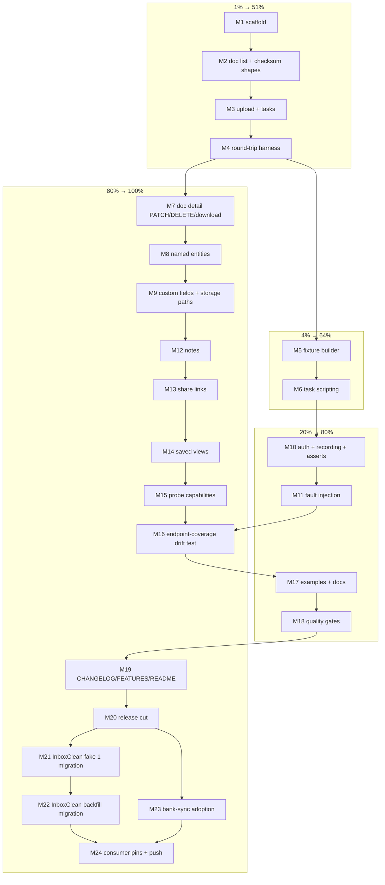

# Pareto Plan — `paperlesstest`: consumer testing SDK for go-paperless

_Point-in-time execution plan. Created 2026-09-23 16:19. Annotate, never rewrite
(docs-health ANNOTATE mode)._

## Context in one paragraph

go-paperless ships zero exported test surface: its own ~60 `httptest` servers are
hand-rolled inline in `client_test.go`/`integration_test.go`, and both consumers
re-implement the Paperless-ngx wire protocol from memory. InboxClean alone
carries two hand-written fakes in `cmd/inboxclean/paperless_command_test.go`
(`fakePaperlessServer` at :245 and the backfill fake at ~:1100-1259) that
hand-encode the paperless-ngx 3.1.0 checksum-in-`versions[]` shape — a drift
hazard against the real API, and bank-sync barely unit-tests its paperless
paths at all. go-sse solved the same problem with its `ssetest/` module. This
plan builds `paperlesstest/`: a stdlib-only, stateful in-memory fake
Paperless-ngx server plus fixtures, task scripting, fault injection, and
request assertions — **verified round-trip against the real `Client`** inside
this repo, so the fake cannot drift from what the SDK expects. Then it
migrates InboxClean (deleting both fakes) and gives bank-sync real unit tests.

## Key decisions

| ID  | Decision                          | Choice and why                                                                                                                                                    |
| --- | --------------------------------- | ----------------------------------------------------------------------------------------------------------------------------------------------------------------- |
| D1  | Package location                  | Subpackage `paperlesstest/` **inside the existing module** — AGENTS.md declares a single-module repo; stdlib-only deps keep consumer `go.mod` graphs clean          |
| D2  | Drift guard                       | Every fake route is exercised **through the real `Client`** in round-trip tests here; a mechanical endpoint-coverage test (docs_drift_test.go pattern) gates new SDK endpoints without fake support |
| D3  | Checksum shape                    | One `WithChecksumShape(Flat\|Versions)` switch serves both pre-3.x and 3.x document shapes — kills InboxClean's hand-encoded 3.1.0 shape comment                    |
| D4  | Scope                             | Wire protocol only. No ledger/projection helpers — those stay consumer-side per AGENTS.md scope                                                                   |
| D5  | Release                           | Ships in the next cut (v0.4.0 or folded into the pending v0.3.2 coordination decision); consumer pins bumped after release                                        |

## Pareto breakdown

### 1% delivering 51%

**The stateful fake core + round-trip harness (M1-M4).** A `NewServer(t)` that
speaks ping, paginated document lists in both checksum shapes, `post_document`
upload, and `/api/tasks/` polling — each route proven through the real
`Client`. This alone replaces the core of both InboxClean fakes and gives
bank-sync its first real paperless unit tests. Everything else is additive.

### 4% delivering 64%

**+ Fixture builder API and task scripting (M5-M6).** `WithDocuments(...)`,
`WithChecksumShape`, `WithTaskSuccess/Duplicate/PendingThenSuccess` — the exact
surface InboxClean's fakes hand-roll today. With M1-M6 the InboxClean
migration is fully unblocked.

### 20% delivering 80%

**+ Auth/request recording/assertions (M10), fault injection (M11), examples +
docs (M17), quality gates (M18).** Consumers can now test happy paths, auth
failures, retries/429s, and assert on captured uploads — the complete
"properly test things well" story, documented and gated green.

### The remaining 80%→100%

Named entities (M8-M9), document detail endpoints (M7), notes/share-links/
saved-views/probe fakes (M12-M15), endpoint-coverage drift test (M16),
housekeeping + release (M19-M20), consumer migrations (M21-M24).

## Execution graph

## Medium plan (30-100 min tasks)

| #   | Task                                                                  | Tier | Impact | Effort | Consumer value                                             |
| --- | --------------------------------------------------------------------- | ---- | ------ | ------ | ---------------------------------------------------------- |
| M1  | Scaffold `paperlesstest/`: doc.go, Server, option pattern, router     | 1%   | High   | 45m    | Foundation everything sits on                              |
| M2  | Document list endpoint: paginated envelope, flat + versions checksums | 1%   | High   | 60m    | Kills the hand-encoded 3.1.0 shape in InboxClean           |
| M3  | Upload (`post_document`) + task store + `/api/tasks/` polling         | 1%   | High   | 60m    | The upload→consume loop every consumer tests               |
| M4  | Round-trip harness: real `Client` vs fake, ping + checksums + upload  | 1%   | High   | 45m    | The drift guard; fake provably matches the SDK             |
| M5  | Fixture builder: `WithDocuments`, `WithChecksumShape`, doc options    | 4%   | High   | 45m    | Declarative test setup replaces hand-built JSON            |
| M6  | Task scripting: success / duplicate / failure / pending-then-success  | 4%   | High   | 45m    | `WaitForTask` and duplicate-refusal paths testable         |
| M10 | Auth enforcement, request recording, assertion helpers                | 20%  | High   | 45m    | 401 paths + upload capture assertions                      |
| M11 | Fault injection: status scripts, 429+Retry-After, 5xx, malformed JSON | 20%  | High   | 60m    | `WithRetry`/error-code paths testable by consumers         |
| M17 | `example_test.go` + package README + root README section              | 20%  | Med    | 45m    | Discoverability; consumers onboard in minutes              |
| M18 | Quality gates: build/test/race/lint/buildflow green                   | 20%  | High   | 30m    | Repo stays releasable                                      |
| M7  | Document detail: PATCH, DELETE, download, metadata list               | rest | Med    | 60m    | Backfill/verify flows (InboxClean fake 2) covered          |
| M8  | Named entities: tags/correspondents/document_types + ensure flow      | rest | Med    | 60m    | `Ensure*` paths testable                                   |
| M9  | Custom fields + storage paths + name lookups                          | rest | Med    | 45m    | Full named-entity surface                                  |
| M12 | Notes endpoints fake                                                  | rest | Low    | 30m    | Completeness                                               |
| M13 | Share links fake                                                      | rest | Low    | 30m    | Completeness                                               |
| M14 | Saved views fake                                                      | rest | Low    | 30m    | Completeness                                               |
| M15 | ProbeCapabilities fake                                                | rest | Low    | 30m    | Version/capability probing testable                        |
| M16 | Endpoint-coverage drift test (docs_drift_test.go pattern)             | rest | High   | 45m    | New SDK endpoints can't ship without fake support          |
| M19 | CHANGELOG + FEATURES + AGENTS.md conventions                          | rest | Med    | 30m    | Honest inventory                                           |
| M20 | Release cut + proxy/pkg.go.dev verification                           | rest | High   | 30m    | Delivery                                                   |
| M21 | InboxClean: replace `fakePaperlessServer` (:245)                      | rest | High   | 60m    | ~60 lines of hand-rolled fake deleted                      |
| M22 | InboxClean: replace backfill fake (~:1100-1259)                       | rest | High   | 60m    | The drift-hazard fake deleted                              |
| M23 | bank-sync: paperlesstest-based unit tests for paperless paths         | rest | Med    | 90m    | First real coverage of its paperless integration           |
| M24 | Consumer pins bumped, vendored, green, pushed                         | rest | High   | 30m    | Rollout complete                                           |

## Fine breakdown (≤12 min tasks)

| #   | Parent | Task                                                            | Effort |
| --- | ------ | --------------------------------------------------------------- | ------ |
| F1  | M1     | `paperlesstest/doc.go` package documentation                    | 10m    |
| F2  | M1     | `Server` struct + `NewServer(t, opts...)` + option type         | 12m    |
| F3  | M1     | Route switch, `t.Cleanup(Close)`, unexpected-request `t.Errorf` | 12m    |
| F4  | M1     | Smoke test: starts, 404s unknown routes                         | 10m    |
| F5  | M2     | `Document` fixture type                                         | 10m    |
| F6  | M2     | Paginated envelope writer (page/page_size, short-page end)      | 12m    |
| F7  | M2     | Flat checksum serialization                                     | 10m    |
| F8  | M2     | `versions[]` 3.x serialization with `is_root`                   | 12m    |
| F9  | M2     | Tests: `ListDocumentChecksums` against both shapes              | 12m    |
| F10 | M3     | `post_document` handler: capture multipart, return task UUID    | 12m    |
| F11 | M3     | Task store: taskID → scripted outcome                           | 10m    |
| F12 | M3     | `/api/tasks/` handler honoring `task_id` query                  | 12m    |
| F13 | M3     | Success `result_data.document_id` + `related_document_ids`      | 10m    |
| F14 | M3     | Test: Upload → WaitForTask happy path                           | 12m    |
| F15 | M4     | Helper: `NewClient(t, srv)` wiring real client at fake          | 10m    |
| F16 | M4     | Round-trip: Ping                                                | 10m    |
| F17 | M4     | Round-trip: checksum lists, both shapes                         | 12m    |
| F18 | M4     | Round-trip: upload → task → document visible in list            | 12m    |
| F19 | M5     | `WithDocuments(...)` option                                     | 10m    |
| F20 | M5     | `WithChecksumShape(Flat\|Versions)`                             | 10m    |
| F21 | M5     | Document option helpers (title, tags, content, fields)          | 12m    |
| F22 | M5     | Fixture builder tests                                           | 10m    |
| F23 | M6     | `WithTaskSuccess(docID)`                                        | 10m    |
| F24 | M6     | `WithTaskDuplicate(docID, inTrash)`                             | 10m    |
| F25 | M6     | `WithTaskPendingThenSuccess(n)`                                 | 12m    |
| F26 | M6     | Test: WaitForTask across pending polls                          | 12m    |
| F27 | M10    | `WithToken` auth enforcement → 401 body                         | 10m    |
| F28 | M10    | Request log (method, path, query, headers)                      | 12m    |
| F29 | M10    | `srv.Uploads()` captured multipart accessor                     | 10m    |
| F30 | M10    | `RequireAuthorized` / `RequireUploadCount` helpers              | 12m    |
| F31 | M11    | Per-path status-sequence failure scripts                        | 12m    |
| F32 | M11    | 429 + `Retry-After` header variants (seconds + HTTP-date)       | 12m    |
| F33 | M11    | 5xx-then-success retryable sequences                            | 10m    |
| F34 | M11    | Malformed JSON / truncated body faults                          | 10m    |
| F35 | M11    | Round-trip: WithRetry recovery, RetryAfterError, error codes    | 12m    |
| F36 | M17    | Example: upload → task → list flow                              | 12m    |
| F37 | M17    | Example: fault injection + retry                                | 10m    |
| F38 | M17    | `paperlesstest/README.md` quick start                           | 12m    |
| F39 | M17    | Root README consumer-testing section                            | 10m    |
| F40 | M18    | `nix run .#build` + `#test`                                     | 12m    |
| F41 | M18    | `nix run .#test-race` + `#lint`, fix findings                   | 12m    |
| F42 | M18    | buildflow verify run                                            | 8m     |
| F43 | M7     | PATCH handler + patch recording                                 | 12m    |
| F44 | M7     | DELETE handler + deleted-IDs recording                          | 10m    |
| F45 | M7     | Download handler serving stored content                         | 10m    |
| F46 | M7     | Metadata list shape (`ListDocumentMetas`)                       | 12m    |
| F47 | M7     | Round-trip: Update/Delete/Download/ListDocumentMetas            | 12m    |
| F48 | M8     | Tags list + create                                              | 12m    |
| F49 | M8     | Correspondents list + create                                    | 10m    |
| F50 | M8     | Document types list + create                                    | 10m    |
| F51 | M8     | `matching_algorithm` PATCH                                      | 12m    |
| F52 | M8     | Round-trip: EnsureTag/Correspondent/DocumentType                | 12m    |
| F53 | M9     | Custom fields list + create                                     | 10m    |
| F54 | M9     | Storage paths list + create                                     | 10m    |
| F55 | M9     | Detail-by-id endpoints (name lookups)                           | 12m    |
| F56 | M9     | Round-trip: Find/Ensure custom field + storage path             | 12m    |
| F57 | M12    | Notes list + add                                                | 10m    |
| F58 | M12    | Note delete                                                     | 8m     |
| F59 | M12    | Round-trip tests                                                | 12m    |
| F60 | M13    | Share links list + create                                       | 10m    |
| F61 | M13    | Share link delete                                               | 8m     |
| F62 | M13    | Round-trip tests                                                | 12m    |
| F63 | M14    | Saved views list + create with filter rules                     | 10m    |
| F64 | M14    | Saved view delete                                               | 8m     |
| F65 | M14    | Round-trip tests                                                | 12m    |
| F66 | M15    | Version/header behavior options                                 | 10m    |
| F67 | M15    | Capability matrix options                                       | 8m     |
| F68 | M15    | Round-trip: ProbeCapabilities matrix                            | 12m    |
| F69 | M16    | Mechanical endpoint enumeration of client.go                    | 12m    |
| F70 | M16    | Fake route registry                                             | 10m    |
| F71 | M16    | Coverage test: every endpoint has a fake route                  | 12m    |
| F72 | M16    | Wire into docs_drift_test.go conventions                        | 10m    |
| F73 | M19    | CHANGELOG [Unreleased] entry                                    | 8m     |
| F74 | M19    | FEATURES.md rows                                                | 8m     |
| F75 | M19    | ERROR_CODES cross-reference check                               | 6m     |
| F76 | M19    | AGENTS.md conventions bullet for paperlesstest                  | 8m     |
| F77 | M20    | Version bump flake + CHANGELOG heading                          | 10m    |
| F78 | M20    | Tag + `nix run .#release-verify`                                | 12m    |
| F79 | M20    | Proxy + pkg.go.dev propagation check                            | 8m     |
| F80 | M21    | Swap imports + `fakePaperlessServer` → paperlesstest            | 12m    |
| F81 | M21    | Adapt checksum-listing tests                                    | 12m    |
| F82 | M21    | Adapt upload/task tests                                         | 12m    |
| F83 | M21    | Delete dead fake code                                           | 10m    |
| F84 | M21    | InboxClean suite green                                          | 10m    |
| F85 | M22    | Swap backfill fake server                                       | 12m    |
| F86 | M22    | Adapt PATCH/backfill assertions                                 | 12m    |
| F87 | M22    | Adapt download/delete/verify tests                              | 12m    |
| F88 | M22    | Delete dead fake code + shape comment                           | 10m    |
| F89 | M22    | InboxClean suite green                                          | 10m    |
| F90 | M23    | Inventory bank-sync paperless call sites                        | 10m    |
| F91 | M23    | Add paperlesstest import + first test                           | 12m    |
| F92 | M23    | Upload-path tests                                               | 12m    |
| F93 | M23    | Checksum reconcile tests                                        | 12m    |
| F94 | M23    | Task-poll tests                                                 | 12m    |
| F95 | M23    | Error/retry path tests                                          | 12m    |
| F96 | M23    | bank-sync suite green                                           | 10m    |
| F97 | M23    | Race run                                                        | 10m    |
| F98 | M24    | Bump consumer pins to release                                   | 10m    |
| F99 | M24    | Vendor hashes + `nix flake check` both consumers                | 12m    |
| F100| M24    | Push consumers (with owner go)                                  | 8m     |

## Risks and guards

| Risk                                                     | Guard                                                                                  |
| -------------------------------------------------------- | -------------------------------------------------------------------------------------- |
| Fake drifts from real Paperless-ngx / from the SDK       | D2 round-trip tests + M16 endpoint-coverage gate; the fake is tested, not trusted      |
| Scope creep into consumer domain (ledgers, pipelines)    | D4: wire protocol only, enforced by AGENTS.md scope review before merge                |
| Test-only deps leak into the module graph                | D1: stdlib-only (`net/http/httptest`, `encoding/json/v2`, `testing`)                   |
| Verschlimmbesserung of existing client tests             | `client_test.go`/`integration_test.go` stay untouched; paperlesstest is purely additive |
| Release coordination with the pending v0.3.2 decision    | M20 explicitly folds into that decision instead of racing it                           |

## Definition of done

- [ ] `paperlesstest/` package: server, fixtures, task scripting, faults, assertions
- [ ] Every fake route exercised through the real `Client` (round-trip)
- [ ] Endpoint-coverage drift test green and gating
- [ ] `nix run .#check` (build/test/test-race/vet/lint) + buildflow green
- [ ] CHANGELOG/FEATURES/README/AGENTS.md updated; released
- [ ] InboxClean: both hand-rolled fakes deleted, suite green
- [ ] bank-sync: paperlesstest-based unit tests, suite green
- [ ] Consumer pins bumped and pushed (with owner go)
